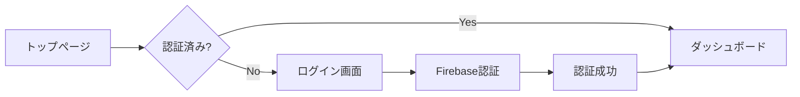

# Firebase SSO認証 実装ガイド

## 概要
このドキュメントでは、Firebaseを使用したSSO（シングルサインオン）認証の一般的な実装パターンと、ベストプラクティスについて説明します。

## 目次
1. [基本的な画面遷移フロー](#基本的な画面遷移フロー)
2. [外部サービス連携（Sharegram）](#外部サービス連携sharegram)
3. [推奨される実装パターン](#推奨される実装パターン)
4. [画面構成例](#画面構成例)
5. [実装の改善案](#実装の改善案)
6. [ベストプラクティス](#ベストプラクティス)

## 基本的な画面遷移フロー

### 初回アクセス時
```
トップページ → ログイン画面 → Firebase認証 → ダッシュボード
```

### 認証済みユーザー
```
トップページ → 自動的にダッシュボード
```

### フローチャート


## 外部サービス連携（Sharegram）

### 基本フロー
```
Sharegram → SSO Gateway → Firebase認証 → 目的のページ
                ↓
        （認証済みなら）→ 目的のページ直行
```

### 詳細フロー
1. **Sharegramからのリダイレクト**
   ```
   https://id-manager.com/auth/sharegram?user_id=XXX&continue=/kyc/register
   ```

2. **パラメータ検証**
   - user_id の存在確認
   - continue URLの妥当性チェック
   - CSRFトークンの検証

3. **認証状態の確認**
   - 既存セッションの確認
   - Firebaseトークンの検証

4. **認証処理**
   - 未認証：Firebase認証画面を表示
   - 認証済み：次のステップへ

5. **アカウント連携**
   - SharegramユーザーIDとFirebase UIDの紐付け
   - 必要な情報の保存

6. **リダイレクト**
   - continueパラメータで指定されたページへ遷移

## 推奨される実装パターン

### A. シンプルなSSOフロー

```javascript
// SSOエントリーポイント
// /sso/login?provider=google&redirect=/dashboard

const SSOLogin = () => {
  const { provider, redirect } = useQueryParams();
  const { isAuthenticated } = useAuth();
  
  useEffect(() => {
    if (isAuthenticated) {
      // 認証済み → リダイレクト先へ
      navigate(redirect || '/dashboard');
    } else {
      // 未認証 → Firebase認証画面
      showFirebaseAuth(provider);
    }
  }, [isAuthenticated]);
};
```

### B. 外部サービス連携フロー

```javascript
// Sharegramからのアクセス処理
const SharegramAuth = () => {
  const { user_id, continue: continueUrl } = useQueryParams();
  const { user, isAuthenticated } = useAuth();
  
  // パラメータ検証
  if (!validateSharegramParams({ user_id })) {
    return <ErrorPage message="無効なパラメータです" />;
  }
  
  // 認証済みチェック
  if (isAuthenticated) {
    // アカウント連携処理
    linkSharegramAccount(user.uid, user_id);
    navigate(continueUrl);
    return;
  }
  
  // 未認証の場合
  return <FirebaseAuthUI onSuccess={() => navigate(continueUrl)} />;
};
```

## 画面構成例

### 1. 統合ログイン画面

```
┌─────────────────────────────────────┐
│         Id Manager Login            │
├─────────────────────────────────────┤
│                                     │
│    ┌─────────────────────────┐     │
│    │  Googleでログイン        │     │
│    └─────────────────────────┘     │
│                                     │
│    ─────── または ───────           │
│                                     │
│    メールアドレス                   │
│    ┌─────────────────────────┐     │
│    │ email@example.com       │     │
│    └─────────────────────────┘     │
│                                     │
│    パスワード                       │
│    ┌─────────────────────────┐     │
│    │ ••••••••                │     │
│    └─────────────────────────┘     │
│                                     │
│    ┌─────────────────────────┐     │
│    │      ログイン           │     │
│    └─────────────────────────┘     │
│                                     │
│    Sharegramから来ましたか？       │
│    [Sharegramアカウントで続行]      │
└─────────────────────────────────────┘
```

### 2. SSO専用ゲートウェイ

```
┌─────────────────────────────────────┐
│      Sharegram → Id Manager        │
├─────────────────────────────────────┤
│                                     │
│  Sharegramアカウントを              │
│  Id Managerに連携します             │
│                                     │
│  以下の方法で認証してください：     │
│                                     │
│    ┌─────────────────────────┐     │
│    │    Googleで認証         │     │
│    └─────────────────────────┘     │
│                                     │
│    ┌─────────────────────────┐     │
│    │    メールで認証         │     │
│    └─────────────────────────┘     │
│                                     │
│  セキュリティ情報                   │
│  ・すべての通信は暗号化されています │
│  ・認証情報は安全に保護されます     │
└─────────────────────────────────────┘
```

## 実装の改善案

### 1. 統一されたエントリーポイント

```javascript
// ルーティング設定
<Routes>
  <Route path="/auth/login" element={<UnifiedLoginPage />} />
  <Route path="/auth/callback" element={<AuthCallback />} />
  <Route path="/auth/sharegram" element={<SharegramGateway />} />
</Routes>
```

### 2. 認証フロー管理コンポーネント

```javascript
const UnifiedLoginPage = () => {
  const location = useLocation();
  const searchParams = new URLSearchParams(location.search);
  const source = searchParams.get('source');
  const continueUrl = searchParams.get('continue');
  
  // Sharegramからのアクセス
  if (source === 'sharegram') {
    return (
      <SharegramAuthFlow 
        continueUrl={continueUrl}
        sharegramUserId={searchParams.get('user_id')}
      />
    );
  }
  
  // 通常のログイン
  return <StandardLoginFlow defaultRedirect="/dashboard" />;
};
```

### 3. 認証コンテキストの改善

```javascript
// 認証状態の詳細管理
const AuthContext = createContext({
  // Firebase認証状態
  firebaseUser: null,
  firebaseToken: null,
  
  // アプリケーション認証状態
  appSession: {
    userId: null,
    email: null,
    role: null,
    expiresAt: null
  },
  
  // 外部サービス連携情報
  externalLinks: {
    sharegram: {
      userId: null,
      linked: false,
      linkedAt: null
    }
  },
  
  // メソッド
  linkExternalAccount: async (service, externalUserId) => {},
  unlinkExternalAccount: async (service) => {},
  refreshSession: async () => {}
});
```

### 4. セッション管理の実装

```javascript
class SessionManager {
  constructor() {
    this.storage = window.sessionStorage;
    this.cookieOptions = {
      secure: true,
      sameSite: 'strict',
      httpOnly: true
    };
  }
  
  async createSession(user, token) {
    // セッション作成
    const session = {
      userId: user.uid,
      email: user.email,
      token: token,
      createdAt: Date.now(),
      expiresAt: Date.now() + (24 * 60 * 60 * 1000) // 24時間
    };
    
    // サーバー側でセッション保存
    await api.post('/api/sessions', session);
    
    // クライアント側でも保持
    this.storage.setItem('session', JSON.stringify(session));
    
    return session;
  }
  
  async validateSession() {
    const session = this.getLocalSession();
    if (!session) return false;
    
    // 有効期限チェック
    if (session.expiresAt < Date.now()) {
      this.clearSession();
      return false;
    }
    
    // サーバー側で検証
    try {
      const response = await api.get('/api/sessions/validate');
      return response.data.valid;
    } catch {
      return false;
    }
  }
}
```

## ベストプラクティス

### 1. シームレスな体験
- **自動ログイン**: 認証済みユーザーは再認証不要
- **リダイレクト保持**: ログイン前のページに戻る
- **エラーリカバリー**: 適切なフォールバック処理

### 2. セキュリティ対策

#### CSRF対策
```javascript
// Stateパラメータを使用
const generateState = () => {
  return crypto.randomBytes(32).toString('hex');
};

// 認証開始時
const state = generateState();
sessionStorage.setItem('auth_state', state);
window.location.href = `/auth/login?state=${state}`;

// コールバック時
const receivedState = params.get('state');
const savedState = sessionStorage.getItem('auth_state');
if (receivedState !== savedState) {
  throw new Error('Invalid state parameter');
}
```

#### リダイレクトURLのホワイトリスト
```javascript
const ALLOWED_REDIRECT_URLS = [
  '/dashboard',
  '/personal-info/create',
  '/kyc/register'
];

const validateRedirectUrl = (url) => {
  // 相対URLのみ許可
  if (!url.startsWith('/')) return false;
  
  // ホワイトリストチェック
  return ALLOWED_REDIRECT_URLS.some(allowed => 
    url.startsWith(allowed)
  );
};
```

### 3. UX向上のポイント

#### ローディング表示
```javascript
const AuthLoading = () => (
  <div className="flex items-center justify-center min-h-screen">
    <div className="text-center">
      <div className="animate-spin rounded-full h-12 w-12 border-b-2 border-blue-600 mx-auto mb-4"></div>
      <p className="text-gray-600">認証中...</p>
    </div>
  </div>
);
```

#### エラーメッセージの改善
```javascript
const ERROR_MESSAGES = {
  'auth/user-not-found': 'アカウントが見つかりません。新規登録してください。',
  'auth/wrong-password': 'パスワードが間違っています。',
  'auth/too-many-requests': 'ログイン試行回数が多すぎます。しばらくお待ちください。',
  'network-error': 'ネットワークエラーが発生しました。接続を確認してください。',
  'session-expired': 'セッションの有効期限が切れました。再度ログインしてください。'
};
```

#### 認証方法の選択肢
```javascript
const AuthMethodSelector = () => (
  <div className="space-y-4">
    <button className="w-full flex items-center justify-center px-4 py-2 border border-gray-300 rounded-md shadow-sm bg-white hover:bg-gray-50">
      <GoogleIcon className="w-5 h-5 mr-2" />
      Googleでログイン
    </button>
    
    <button className="w-full flex items-center justify-center px-4 py-2 border border-gray-300 rounded-md shadow-sm bg-white hover:bg-gray-50">
      <EmailIcon className="w-5 h-5 mr-2" />
      メールでログイン
    </button>
    
    <button className="w-full flex items-center justify-center px-4 py-2 bg-blue-600 text-white rounded-md hover:bg-blue-700">
      <SharegramIcon className="w-5 h-5 mr-2" />
      Sharegramアカウントで続行
    </button>
  </div>
);
```

## まとめ

Firebase SSOの実装では、以下の点が重要です：

1. **統一されたエントリーポイント**: `/auth/login` に集約
2. **柔軟な認証フロー**: 通常ログインと外部連携の両対応
3. **セキュリティ**: CSRF対策、URL検証、セッション管理
4. **ユーザー体験**: シームレスな遷移、分かりやすいエラー

これらの要素を適切に実装することで、安全で使いやすい認証システムを構築できます。